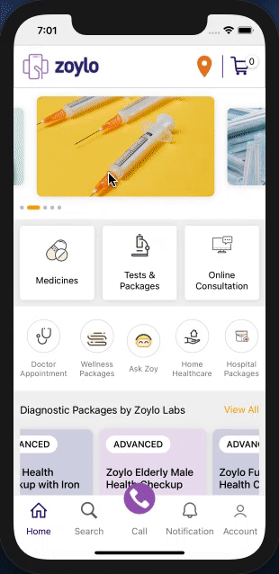

# TTN - Assessment

Date: 15/3/21

## Session: React Native Assessment

Create the below screen in react-native 

[Screen](https://drive.google.com/file/d/1-Y3RZQKW6f4i0rgl5_qHL5zVRfceDAsk/view)

Points to consider 

* Minimum use of margin and padding 
* All cells should be clickable and should show corresponding alert 
* In case a cell is not visible it means it will scroll horizontally (Check Interaction Video)
* Use icon8.com to get required icons 
* Create a separate repo 
* Follow the structure and naming conventions as told in class
* Copy and paste code, you will be marked 0
* Check interaction video for better understanding 
* Bottom Tab navigation should show alert on every icon clicked
* No commits are going to be considered after 7:00 PM 15th March 2021
* Good Luck!

## Output:
</img>